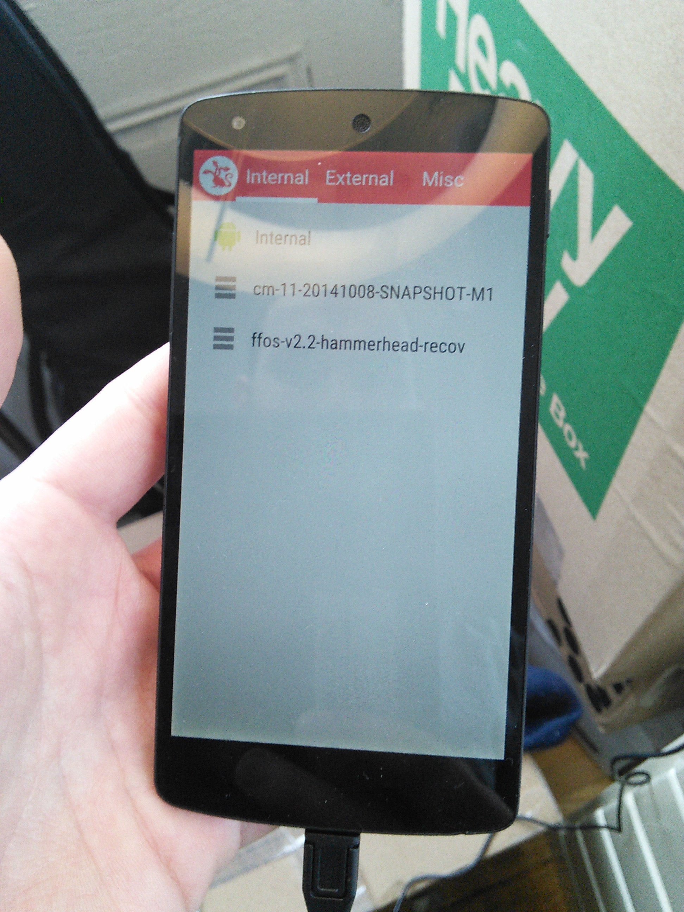
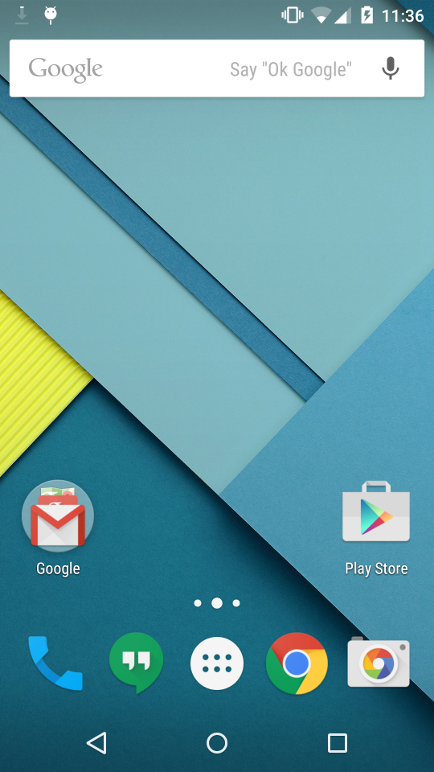
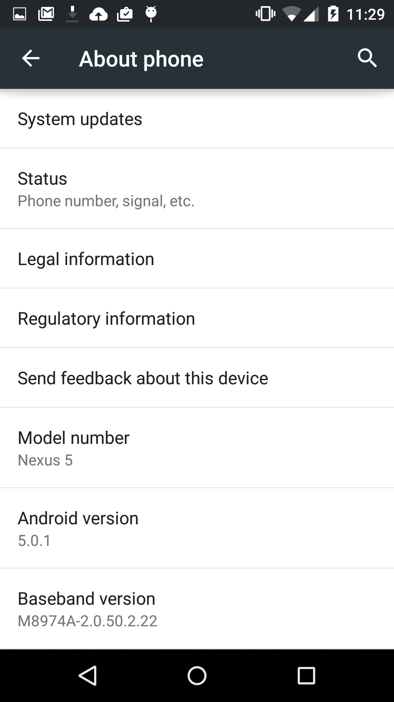
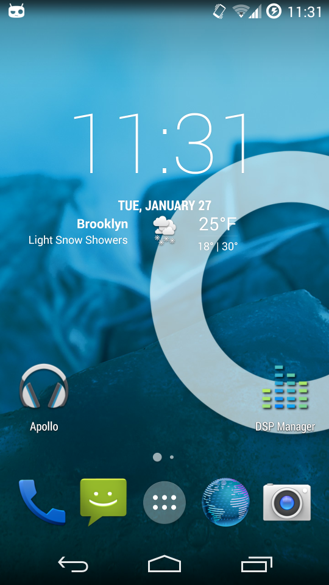
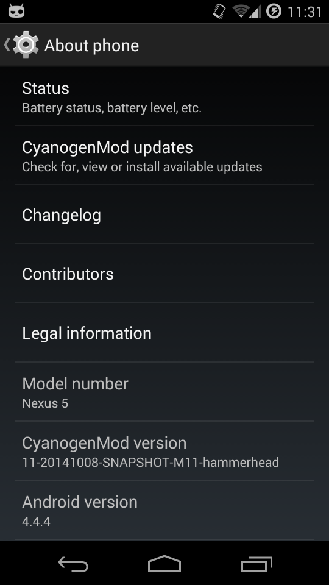
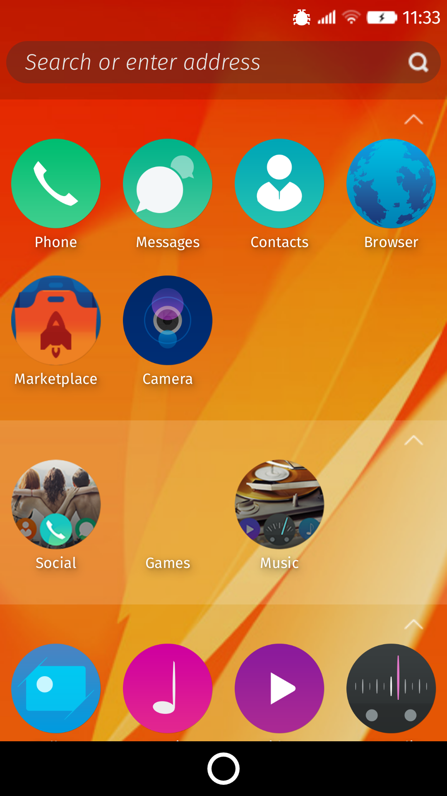
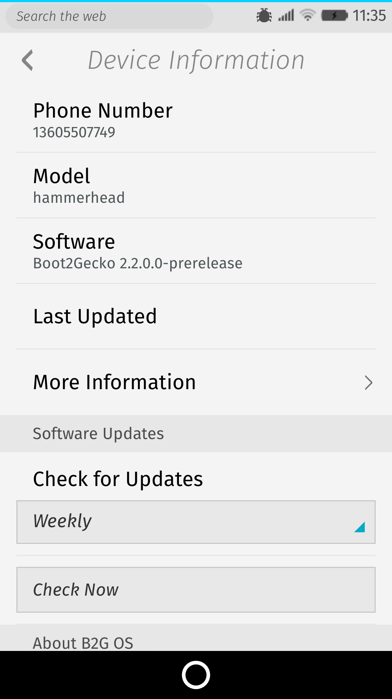

The Nexus 5 triple-play
======

These are the steps I used to get triple-boot working on my phone. Use at your own risk.

When your device starts up, you have a choise of 3 OSes:

* Stock Lollipop 5.0.1
* CyanogenMod 11 (Kitkat 4.4.4)
* Firefox OS 2.2.0

It will automatically boot into the first one after 5 seconds.

These steps will delete all the data on your phone, so back up whatever you need backed up.

Screenshots
---

### The triple-play

### Stock Lollipop

### CyanogenMod 11 (Kitkat)

### Firefox OS 2.2.0

Flash stock lollipop
---------

Go to [the Nexus factory images site](https://developers.google.com/android/nexus/images), download the latest image for hammerhead (Nexus 5).

Run `adb reboot bootloader` on your device to reboot to the bootloader. (Or hold volume down+power when it's switched off.)

Extract the TGZ, run `./flash-all.sh`. It may take awhile.

Root it with ClockworkMod Recovery
----

Go to [the ClockworkMod home page](http://www.clockworkmod.com/rommanager), search for "nexus 5," and download the "recovery." I prefer not to use the "touch" recovery (i.e. you have to press the volume and power buttons to navigate the interface).

Put your device back in bootloader mode. You might have to go into the phone's settings and tap the build number 5 times to enable the developer menu, then go to the developer menu, then choose "allow ADB debugging." Then you can do `adb reboot bootloader`.

While the phone is in bootloader mode, run `fastboot flash recovery recovery-clockwork-*-hammerhead.img`. Then press volume down and power to choose "Reboot recovery."

In the ClockworkMod Recovery interface, simply choose "reboot system." ClockworkMod will automatically detect that the phone is not rooted, and will offer to root it. Say yes.

Install MultiROM
-------

Reboot, then go to Google Play and download MultiROM. Run it and follow all the instructions. Don't uncheck any boxes. Reboot into the new MultiROM recovery.

Install Firefox OS and CyanogenMod 11
---------

Download the latest "snapshot" (they mean "release") version of CyanogenMod 11 for hammerhead from [this page](http://download.cyanogenmod.org/?device=hammerhead&type=snapshot).

Mozilla doesn't do an official build for Firefox OS for Nexus 5, and it takes forever to build it yourself. Luckily [this guy](http://forum.xda-developers.com/google-nexus-5/development/nightly-firefox-os-t2960953) does a nightly build and publishes them on the Internet. Go to [his download page](http://ffos.vosky.fr/) and install the version of Firefox OS you want (I chose 2.2.0). Be sure to download the "recovery" version, not the fastboot version.

Push those two files to your sdcard. Just put them anywhere.

Set up triple-boot
------

Reboot into recovery mode (`adb reboot recovery`). In the MultiROM interface, go to "Advanced," then "Add ROM." Make sure you actually chose "Add ROM" &ndash; if  you choose "Install," it will overwite the existing ROM. (I made this mistake and had to redo everything >_<)

Simply choose the .zip files for CyanogenMod and follow the instructions. Do the same thing for the Firefox OS zip file.

Now you have triple-boot running! Enjoy.
